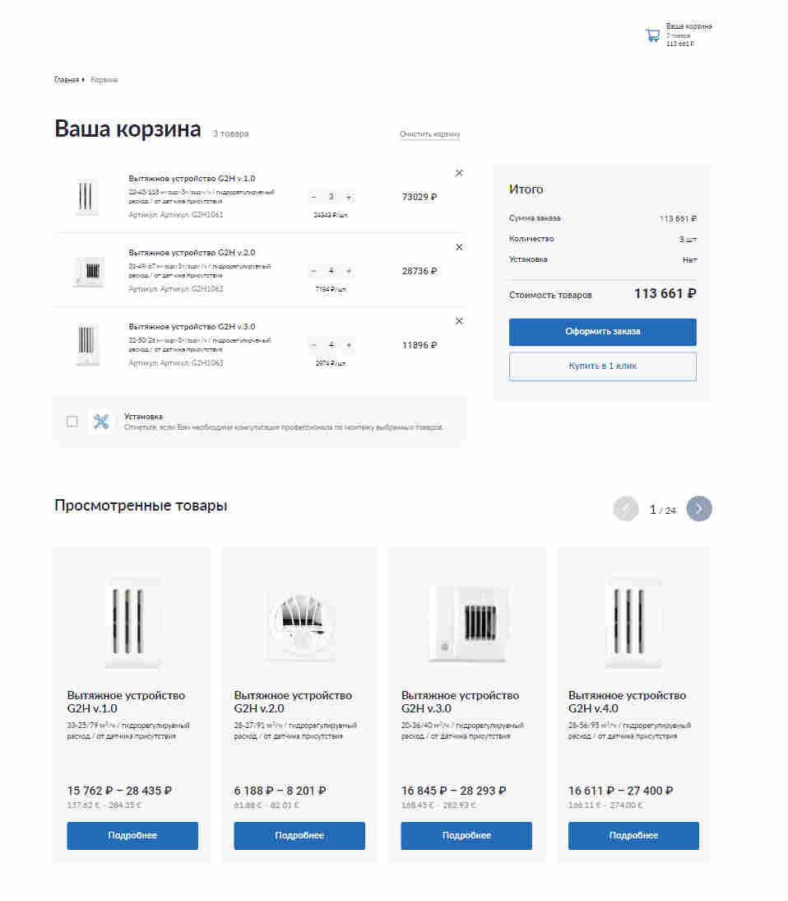

# Nuxt 3 Cart

## Стек:

- Nuxt 3 ssr
- Верстка по BEM
- Typescript
- Vuex
- Swiper.js
- Feature Sliced Design \* (На сколько позволяет nuxt3)

## Реализовано:

- Вывод товаров и их удаление
- Реализовать кнопочки увеличения/уменьшения кол-ва
- Динамические подсчет стоимости заказа, количества товаров, наличие установки, в зависимости от
  состояния чек-бокса
- В шапке выводить кол-во товаров и стоимость заказа
- Реализовать слайдер с товарами (воспользуйтесь Swiper.js)
- При нажатии “Купить в 1 клик” реализовать отправку на сервер
- Серверное api генерирует корзину
- Отзывчивость интерактивных элементов (debounce)

<a href="https://pet.navfront.ru">Ссылка на деплой: https://pet.navfront.ru</a>

